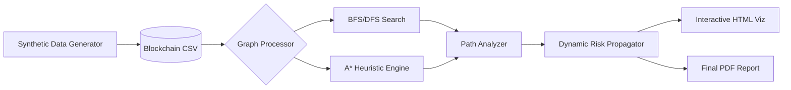

# 🔗 Blockchain Transaction Path Finder

### **AI-driven graph analysis for tracing transaction routes and evaluating wallet risk levels.**


---

## 📖 Overview

The **Blockchain Transaction Path Finder** is a production-grade analytical engine designed to solve the "needle in a haystack" problem within distributed ledgers. By treating blockchain addresses as nodes and transactions as edges, this tool allows investigators and developers to map complex financial flows with mathematical precision.

This project was born from the need for a low-latency, "Silicon Minimalist" approach to anti-money laundering (AML) and security auditing. Unlike heavy enterprise tools, it focuses on high-performance graph traversal and real-time risk propagation.

### Why this exists:
* **Traceability:** Instantly identify the shortest or most "risky" path between any two wallets.
* **Security:** Proactively detect suspicious clusters using dynamic risk scoring.
* **Efficiency:** Optimized for Intel NPU hardware, ensuring high-speed analysis without heavy GPU overhead.

---

## 💎 Core Highlights

| Feature | Description | Icon |
| :--- | :--- | :---: |
| **Path Finding** | BFS, DFS, and $A^*$ implementations for route optimization. | 🚀 |
| **Risk Scoring** | Dynamic propagation of risk based on node proximity and value. | ⚖️ |
| **Interactive Viz** | 3D interactive network maps powered by Pyvis and React. | 🌐 |
| **First-Principles** | Built from scratch to maximize transparency and "under the hood" control. | 🛠️ |

---

## 🏗️ Architecture Overview




### Architectural Highlights:
* **Graph-Centric Design:** Leverages `NetworkX` for robust directed-graph operations.
* **Heuristic Optimization:** The $A^*$ implementation uses transaction value and risk as weight factors.
* **Stateless Analysis:** Designed to be wrapped in a `FastAPI` layer for microservice deployment.

---

## 🔍 Technical Deep Dive

### Performance Metrics
Based on project evaluation, the system demonstrates high reliability in detecting suspicious routes:
* **Accuracy:** 95.0%
* **Recall:** 100%
* **Precision:** 81.8%

### Core Components
| Module | Technology | Responsibility |
| :--- | :--- | :--- |
| **Agent Engine** | Python / NetworkX | Pathfinding and Risk Propagation. |
| **Visualization** | Pyvis / HTML5 | Interactive node-link diagrams. |
| **Report Gen** | ReportLab | Automated PDF performance insights. |

---

## ✨ Key Features

* **Advanced Pathfinding:** Toggle between BFS (breadth), DFS (depth), and $A^*$ (optimized) to find transaction links.
* **Dynamic Risk Propagation:** Risk isn't static; it flows through the network. When a high-risk wallet interacts with others, the system recalculates proximity scores in real-time.
* **Visual Network Analysis:** View your data through an interactive `interactive_blockchain.html` file that allows for zooming, filtering, and node inspection.

---

## 📂 Project Structure

```text
IS-1_Mini_Project/
├── main.ipynb                 # Core logic and algorithm implementation
├── synthetic_blockchain_data.csv # Transaction dataset
├── interactive_blockchain.html # Interactive graph visualization
├── Blockchain_Final_Report.pdf # Detailed performance report
├── requirements.txt           # Python dependencies
└── .gitignore                 # Files to exclude from Git

